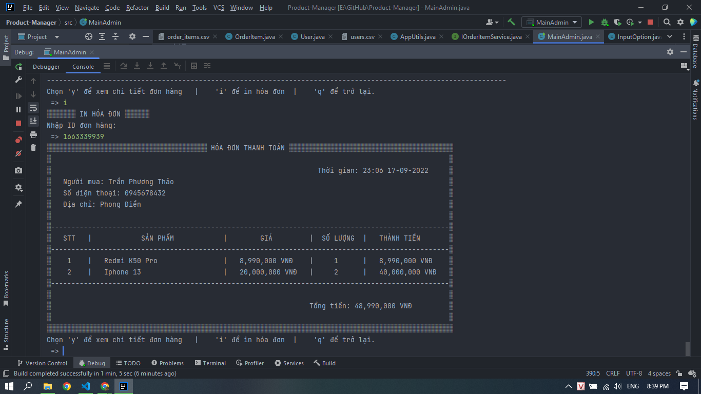

PHONE STORE MANAGER: QUẢN LÝ CỬA HÀNG ĐIỆN THOẠI

1. Kiến thức & Công nghệ áp dụng: Java Core

2. Tổng hợp chức năng:
- Đăng nhập/ Đăng ký.
- Quản lý sản phẩm: Thêm, sửa, xóa(mềm), xem thông tin chi tiết...
- Quản lý nhân viên: Thêm, sửa, xóa(mềm),  xem thông tin chi tiết...
- Quản lý khách hàng: Xem thông tin chi tiết, xóa(mềm),...
- Phân quyền.
- Quản lý hóa đơn: Xem thông tin chi tiết, thêm, sửa, xóa, in hóa đơn, sửa chi tiết hóa đơn...
- Đọc file/ ghi file.
3. Một số hình ảnh

- Quản lý nhân viên

- Quản lý sản phẩm

- Quản lý hóa đơn

- Chi tiết hóa đơn

- In hóa đơn

- Thống kê

